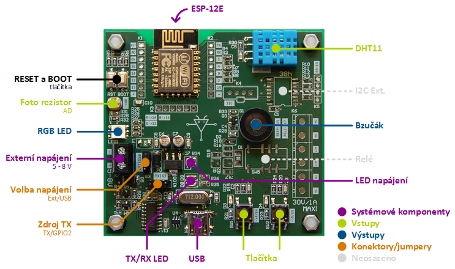

# ESP8266 Demo Board

*Během workshopu budete použvat tento demoboard*

## Vstupy ##

### Tlačítka

K dispozici jsou dvě tlačítka **SW1** a **SW2**. U každého tlačítka je kontrolní LED zapojená proti Vcc. Tlačítka jsou **aktivní v log. 0**.

| Název | Pin |  
| --- | --- | 
| SW1 | GPIO 4 |
| SW2 | GPIO 5 |

### Foto rezistor

Na ADC vstupu ESP je připojený fotorezistor. Ten je zapojený tak, aby při úplném zatmění se napětí pohybovalo kolem 1 V a při jasném osvětlení kolem 0 V.

### DHT 11

DHT 11 je kombinovaný teploměr a vlhkoměr. 

| Název | Pin |  
| --- | --- | 
| DHT11 | GPIO 13 |

## Výstupy

### RGB Led

K dispozici je jedna RGB LED. LED jsou zapojeny proti Vcc, jsou **aktivní v log. 1**. 

| Název | Pin |  
| --- | --- | 
| Red | GPIO 14 |
| Green | GPIO 12 |
| Blue | GPIO 16 |

### Bzučák

K dispozici je jeden magnetodynamický bručák, připojený na **GPIO 15**.

| Název | Pin |  
| --- | --- | 
| Beeper | GPIO 15 |

## Jumpery

### Volba napájení

Jumper slouží k volbě zdroje napájení desky. Napájena může být buď z USB nebo z externího zdroje. 

Ext. zdroje musí být 5 až 8 V, min. 500 mA.

### Zdroj TX

ESP má interně dva sériové porty. Hlavní se používá zejména pro programování. Na GPIO 2 je vyveden TX pin druhého sériového portu (Rx není k dispozici). Tento druhý Tx pin se používá v některých případech pro výpis debug. informací. Proto je možné tímto jumperem zvolit, **který Tx pin bude připojen k USB převodníku**.

## Systémové komponenty

### ESP-12E

Na desce je osazen ESP8266 modul ESP-12E.

### Boot a Reset tlačítka

Reset a boot režim ESP jsou vyvedeny na tlačítka. Za normálních okolností dojde k resetu a správně volbě boot režimu při programování. Je zde ale možnost obojí provést ručně.

### Tx/Rx LED

Na Tx (D9) a Rx (D8) pinech USB převodníku jsou indikační LED.   

### USB

Konektor pro převodník USB <-> sériový port CH340G.

### LED napájení

Indikační LED, který svítí po celou dobu, kdy je deska pod napájením.
   