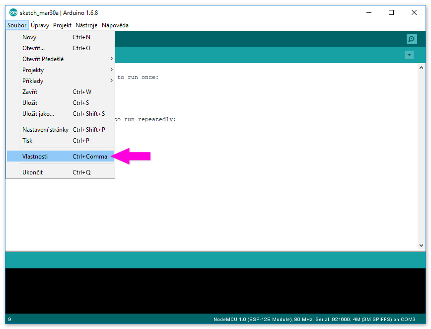
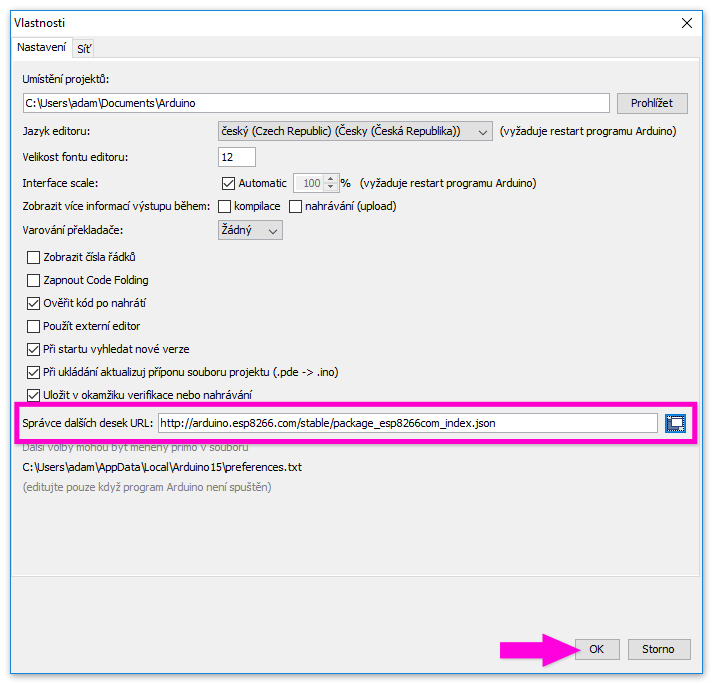
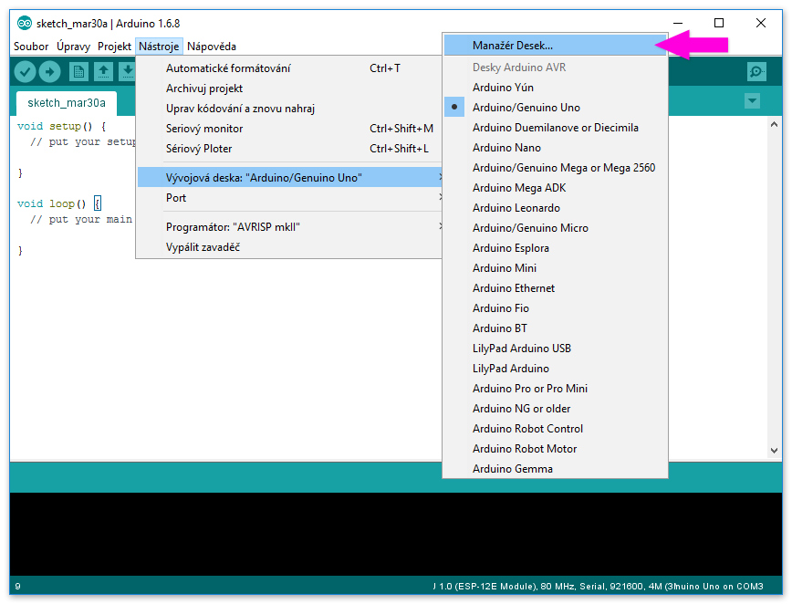
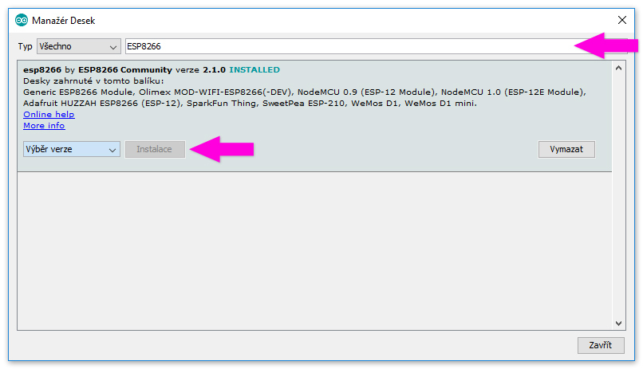
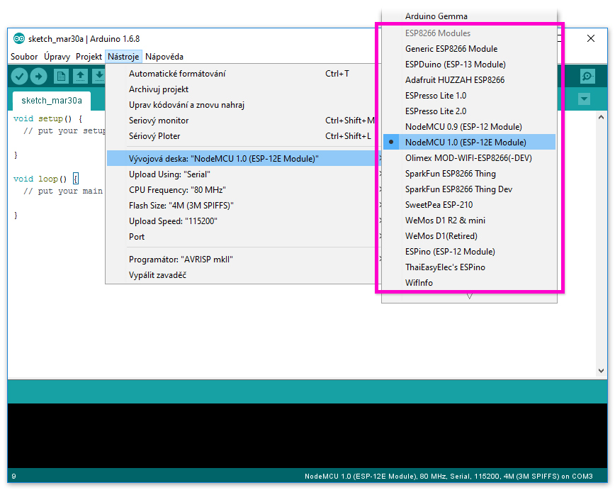

# Postup instalace nezbytného SW

## 1. Arduino IDE

Naistalujte si poslední verzi Arduino IDE pro váš operační systém z webu [http://www.arduino.cc/](http://www.arduino.cc/). 

Minimální verze je 1.6.4.

> Opravdu potřebujete verzi z arduino.cc, IDE od arduino.org nebude fungovat!

Odkazy:

- [https://www.arduino.cc/en/Main/Software](https://www.arduino.cc/en/Main/Software)

## 2. Podpora pro ESP826

Nejsnazší instalace je pomocí **Board Manager** (součást Arduino IDE od verze 1.6.4). 

Aby Board Manager věděl odkud stáhnout podporu pro ESP8266, je třeba přidat URL do nastavení IDE.

Do pole *Správce dalších desek URL* (v anglické verzi *Additional Board Manager URL*) zadejte URL:

`http://arduino.esp8266.com/stable/package_esp8266com_index.json`

Následně pokračujte do *Manažér desek*

Nyní by mělo jít rovnou najít *ESP8266* v dostupných deskách. Vybrat poslední verzi (aktuálně 2.1.0) a klikněte na **Instalovat**.

> :memo: Instalace je poměrně časově náročný postup, **zabere 10 - 30 minut**.

Pokud se vše povedlo, máte nyní v Arduino IDE v nabídce desky postavené nad ESP8266.

Odkazy:

- [https://github.com/esp8266/Arduino](https://github.com/esp8266/Arduino)

## Co dál se může hodit

Pár nástrojů, které nejsou nezbytné. Pro instalační postup navštivte stránky autorů.

### Nástroje

- [Arduino ESP8266 filesystem uploader](https://github.com/esp8266/arduino-esp8266fs-plugin) - rozšíření do Arduino IDE pro podporu generování a nahrávání SPIFFS do ESP
- [esptool.py](https://github.com/themadinventor/esptool) - ESP8266 ROM Bootloader utility

### Opravdové IDE

Co si budeme povídat, Arduino IDE je spíš editor než plnohodnotné IDE. Pokud jste zvyklí spíš na skutečné IDE můžete zkusit:

- [Visual Micro](http://www.visualmicro.com/)
- [PlatformIO](http://platformio.org/)

Obojí podporuje i ESP8266 ve spojení s Arduino knihovnami.