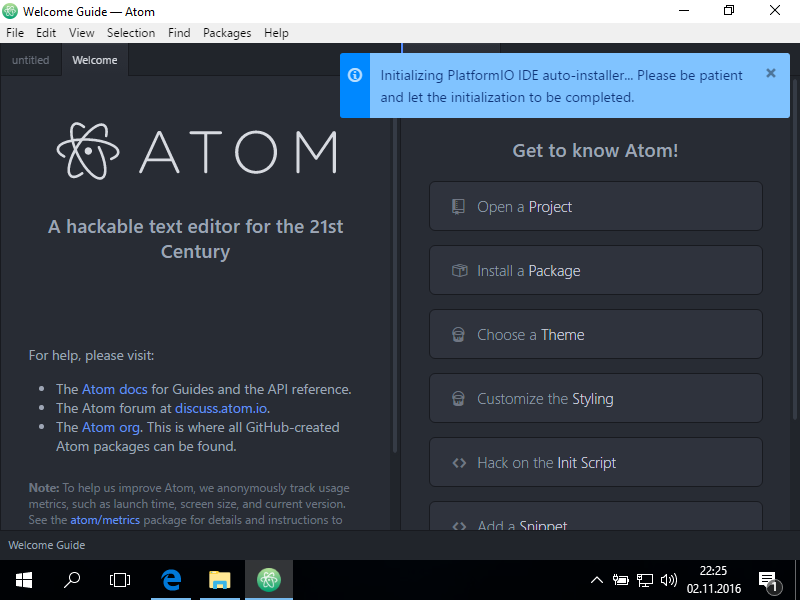
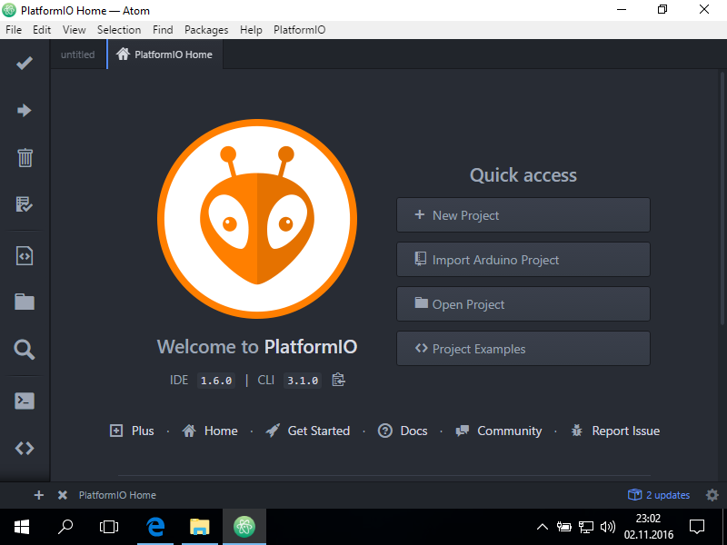
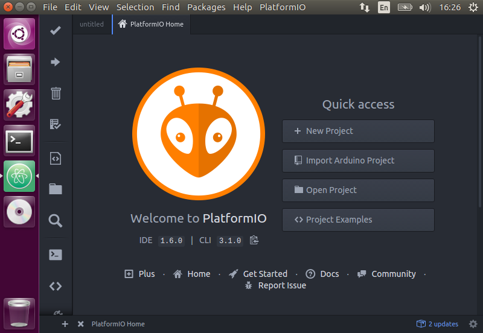
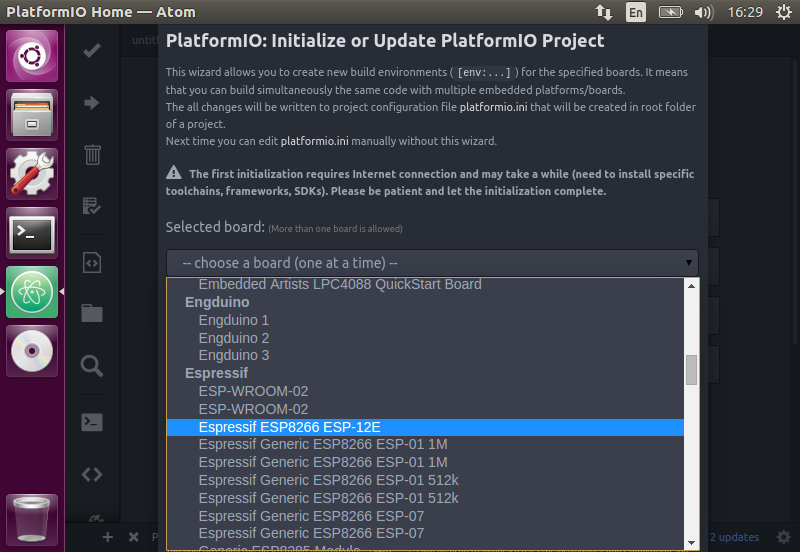
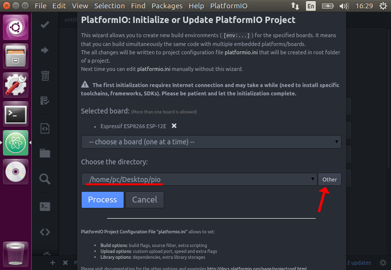
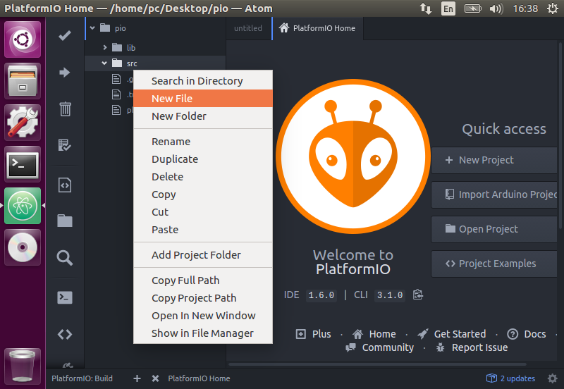
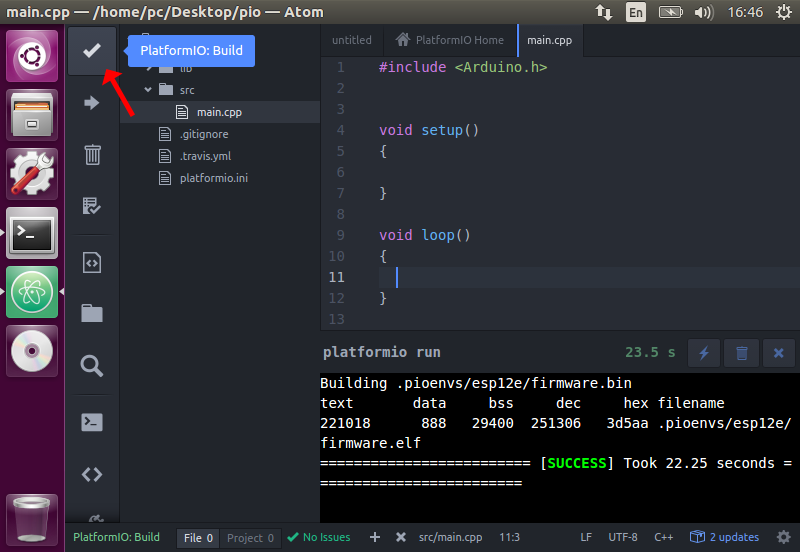

# Postup instalace Platform IO

## Úvod

Základem PlatformIO je sada konzolových nástrojů které umožňují vývoj jednoho kódu pro různé platformy. V současné chvíli podporuje mnoho velkých výrobců HW jako jsou například Atmel, ST Micro, Microchcip, Nordic, NXP, Texas Instruments,...

Druhou (volitelnou) částí, je IDE postavené na editoru [Atom](https://atom.io/). Nicméně PlatformIO jde doinstalovat i do [jiných oblíbených editorů](http://docs.platformio.org/en/stable/ide.html) a nebo ho používat jen z [konzole](http://docs.platformio.org/en/stable/userguide/index.html).

**Pro účely workshopu budeme používat výchozí balíku s editorem Atom.**

Zde následuje *výcuc* nejdůležitějších kroků instalace na **Windows** nebo **Linux** doplněný o **první kompilaci**, abyste si ověřili, že vše funguje.

Kompletní postup instalace najdete na [http://docs.platformio.org/en/stable/ide/atom.html#installation](http://docs.platformio.org/en/stable/ide/atom.html#installation)

## Instalace na Windows

### Systémové požadavky

#### Python 2.7

Platform IO vyžaduje **Python 2.7**. Pokud Python nemáte nainstalovaný, jděte na  [https://www.python.org/downloads/](https://www.python.org/downloads/), stáhněte si instalátor pro Python verze **2.7**! a spusťte jej.

Během instalace se ujistěte, že zaškrtnete možnost "*Add python.exe to Path*"

> Opravdu potřebujete **verzi 2.7**, Python 3.0 nebude fungovat!

#### Clang

Pokud chcete, aby fungovala statická analýza kódu (aby vám editor napovídal), musíte nainstalovat [CLang](http://clang.llvm.org/).

Jděte na [http://llvm.org/releases/download.html](http://llvm.org/releases/download.html), stáhněte instalátor pro Windows a spusťte jej.

Během instalace se ujistěte, že zaškrtnete možnost "*Add LLVM to the system PATH*"

> Pokud během instalace uvidíte chybu `Failed to find MSBuild toolsets directory`, můžete jí ignorovat, ne výslednou funkci nemá vliv. 

### Instalace Platform IO

Stáhněte si instalační soubor z adresy [http://platformio.org/platformio-ide](http://platformio.org/platformio-ide) a nainstalujte.

Nejprve se nainstaluje samotný editor Atom. Při prvním spuštění pak proběhne instalace PlatformIO do Atomu. 



Chvíli to trvá, buďte trpěliví *;)*. Po dokončení instalace se vás aplikace zeptá, jestli se má načíst znovu, potvrďte že ano a tím je instalace dokončená.



*Pokračujte na společnou část níže.* 

## Instalace na Ubuntu 16.04

Pro instalaci stačí stáhnout balíček ze stránek [http://platformio.org/get-started](http://platformio.org/get-started), nainstalovat jej a spustit.

```bash
wget https://dl.bintray.com/platformio/ide-bundles/platformio-atom-linux-x86_64.deb
sudo apt-get install git clang
sudo dpkg -i platformio-atom-linux-x86_64.deb
atom
```

Při prvním spuštění proběhne instalace PlatformIO do Atomu.
Po dokončení instalace se vás aplikace zeptá, jestli se má *načíst znovu*, potvrďte že ano a tím je instalace dokončená.



## Společná část 

### Podpora pro ESP8266

Na záložce *Home* v Atomu klepněte na **New Project**.
Objeví se okno s inicializací projektu.

Je potřeba abyste vybrali v **Select board** položku **Espressif ESP8266 ESP-12E**



Pak zvolte cestu kam projekt uložit.



A poté stiskněte tlačítko **Process**. Nyní automaticky proběhne instalace platformy *espressif8266*.

### Zkouška instalace

V adresáři *src* vytvořte nový soubor se jménem **main.cpp** (klepněte pravým tlačítkem na složku *src* a tam dejte **New File**).



V nově vytvořeném `main.cpp` napište tento kód:

```C++
#include <Arduino.h>

void setup()
{
}

void loop()
{
}
```

A klepněte na *build* (ikona *fajfky* nalevo nahoře)



Pokud vše proběhlo správně, tak byste vpravo dole měli vidět hlášku **SUCCESS**.

## Kam dál

Tím máte vše připravené na **workshop**. Těšíme se na viděnou.

*Pár tipů na závěr*

- Pokud používáte českou klávesnici, mohl by vás zajímat plugin [keyboard-localization](https://atom.io/packages/keyboard-localization)
- PlatformIO můžete nainstalovat a používat čistě z konzole - pro *pythonisty* asi stačí říct `pip install -U platformio` (vice v [dokumentaci](http://docs.platformio.org/en/stable/installation.html))
