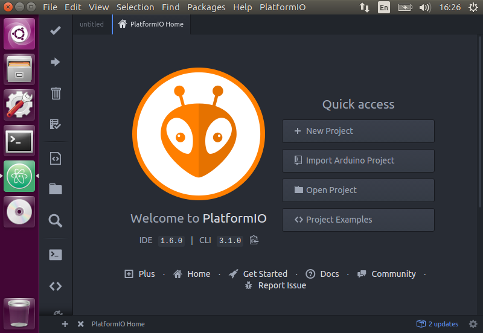
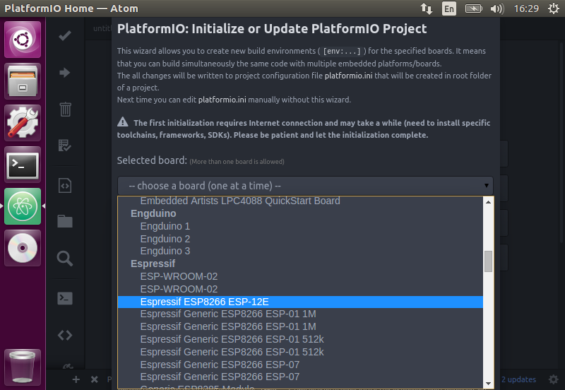
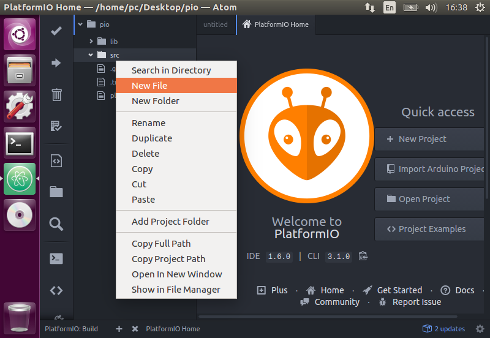

# PlatformIO workshop

## Úvod
Základem PlatformIO je sada konzolových nástrojů které umožňují vývoj jednoho kódu pro různé platformy.
V současné chvíli podporuje mnoho velkých výrobců HW jako jsou například Atmel, ST Micro, Microchcip, Nordic, NXP, Texas Instruments, ...

Druhou (volitelnou) částí, je IDE postavené na editoru Atom (https://atom.io/).
Nicméně PlatformIO jde doinstalovat i do jinných oblíbených editorů a nebo ho používat jen z konzole.
Podporované editory naleznete zde http://docs.platformio.org/en/stable/ide.html

**Pro účely workshopu doporučujeme využít výchozího balíku s editorem Atom.**

## Instalace na Ubuntu 16.04
Pro instalaci stačí stahnout balíček ze stránek http://platformio.org/get-started, nainstalovat jej a spustit.

    wget https://dl.bintray.com/platformio/ide-bundles/platformio-atom-linux-x86_64.deb
    sudo apt-get install git clang
    sudo dpkg -i platformio-atom-linux-x86_64.deb
    atom

Po spuštění proběhne instalace PlatformIO do Atomu.
Po dokončení instalace se vás aplikace zeptá jestli se má *načíst znovu*, potvrďte že ano a tím je instalace dokončená.

## Podpora pro ESP8266

Na záložce *Home* v Atomu klepněte na **New Project**.
Objeví se okno s inicializací projektu.

Je potřeba aby jste vybrali v **Select board** položku **Espressif ESP8266 ESP-12E**

Pak zvolte cestu kam projekt uložit.

A poté stiskněte tlačítko **Process**. Nyní automaticky proběhne instalace platformy *espressif8266*.

## Zkouška instalace

V adresáři *src* vytvořte nový soubor se jménem **main.cpp** (klepněte pravým tlačítkem na složku *src* a tam dejte **New File**).

V nově vytvořeném **main.cpp** napište tento kód:

    #include <Arduino.h>

    void setup()
    {

    }

    void loop()
    {

    }

A klepněte na *build* (ikona *fajfky* nalevo nahoře)

Pokud vše proběhlo správně, tak by jste pravo dole měli vidět hlášku **SUCCESS**.
